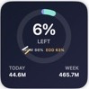
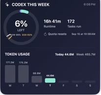
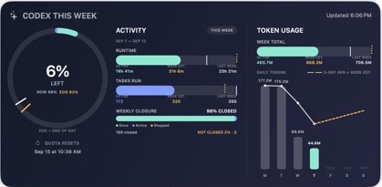

# Codex Week Widget

A native macOS WidgetKit dashboard for local Codex usage. It shows quota pacing,
runtime, completed tasks, and daily/weekly token activity in Small, Large, and
Extra Large widgets.

**No OpenAI API key is required.** The app reads Codex activity logs already
stored on your Mac and never uploads conversation content or usage data.

## Core features

- Refreshes automatically every 30 minutes by default. The interval is
  configurable during installation.
- Includes three native macOS layouts: **Small**, **Large**, and
  **Extra Large (Landscape)**.
- Designed so an iPhone or Apple Watch companion could be added later.
  **Phone and watch sync are not included in the current version.**

## Widget sizes

### Small



Shows the weekly quota ring plus today's and this week's token totals.

### Large



Adds weekly runtime, completed tasks, quota reset time, and the seven-day token
chart.

### Extra Large



Adds separate activity comparisons for today's runtime and completed tasks,
with thin pacing markers for the theoretical target.

## Interface guide

1. **Actual usage vs. theoretical usage** — the quota ring shows the real
   remaining weekly allowance. The white marker shows the even-use target for
   the same point in the seven-day quota window, based on roughly one-seventh
   of the allowance per day.
2. **Today's runtime vs. theoretical pace** — the Runtime row compares today's
   active Codex time with the week total. Its thin marker shows the expected
   share if activity were spread evenly through the week.
3. **Today's tasks vs. theoretical pace** — the Tasks Run row uses the same
   comparison for completed Codex tasks.
4. **Weekly tokens and today's tokens** — the chart compares today's token
   count with the weekly total and shows the distribution across all seven
   weekdays.
5. **Quota reset date** — Quota Resets shows when the current weekly usage
   window is scheduled to reset.

## Requirements

- macOS 14 or newer
- Codex desktop app or CLI with local data in `~/.codex`
- Full Xcode installed in `/Applications/Xcode.app`
- An Apple Development team selected in Xcode (a personal team is sufficient
  for local installation)
- [Homebrew](https://brew.sh), XcodeGen, and jq

Install the command-line dependencies:

```bash
brew install xcodegen jq
```

## Install

Clone the repository and run the guided installer:

```bash
git clone https://github.com/walkingbamboo/codex-week-widget.git
cd codex-week-widget
chmod +x scripts/*.sh
./scripts/install.sh
```

The installer asks for:

1. Your 10-character Apple Developer Team ID
2. A unique bundle prefix such as `com.yourname`
3. Your Codex data directory (default: `~/.codex`)
4. Refresh interval (default: 30 minutes)
5. Your IANA timezone (automatically detected by default)

These values stay in local build settings or
`~/Library/Application Support/CodexWeek/config.env`; they are never committed.

The app is installed to `~/Applications/CodexWeek.app`. After installation,
right-click the desktop, choose **Edit Widgets**, search for **Codex Week**, and
pick a size.

## Find your Apple Developer Team ID

Open **Xcode → Settings → Accounts**, select your Apple ID and team, then copy
the Team ID. If necessary, create a simple macOS project once and let Xcode
manage signing for your personal team.

## Privacy and data source

Codex Week processes local rollout JSONL files and `state_5.sqlite` from the
configured Codex data directory. It extracts only timestamps, task completion
durations, token counters, and quota-rate-limit values. It does not send data
over the network and does not require a PAT or API credential.

The generated snapshot is atomically written to:

```text
~/Library/Application Support/CodexWeek/codex-week-snapshot.json
```

The Widget extension has read-only access to that directory. Automatic refresh
is managed by `~/Library/LaunchAgents/io.github.codexweek.refresh.plist`.

## Troubleshooting

### Widget is blank or disappears after changing size

```bash
./scripts/repair_widget.sh
```

If that does not help, remove the widget from the desktop, run the repair
script, and add it again.

### Data does not refresh

Check the background job and snapshot:

```bash
launchctl print gui/$(id -u)/io.github.codexweek.refresh
stat "$HOME/Library/Application Support/CodexWeek/codex-week-snapshot.json"
```

Refresh logs are stored in `~/Library/Logs/CodexWeek/`.

### Build signing fails

Verify the Team ID, use a unique bundle prefix, and confirm Xcode has downloaded
the signing certificate for that team. Re-run `./scripts/install.sh` after
correcting the value.

## Uninstall

```bash
./scripts/uninstall.sh
```

The app, LaunchAgent, and configuration are moved to Trash so they remain
recoverable.

## Project structure

- `App/` — macOS host app and manual refresh UI
- `Widget/` — WidgetKit views for all supported sizes
- `Shared/` — snapshot model and local file loading
- `scripts/collect_codex_week.sh` — local Codex log aggregation
- `scripts/install.sh` — guided build, signing, install, and background setup
- `project.yml` — XcodeGen project definition

## Notes

Codex log schemas are internal implementation details and may change in future
Codex releases. If metrics stop updating after a Codex update, open an issue
with the non-sensitive error output from `~/Library/Logs/CodexWeek/`.

## License

[MIT](LICENSE)
